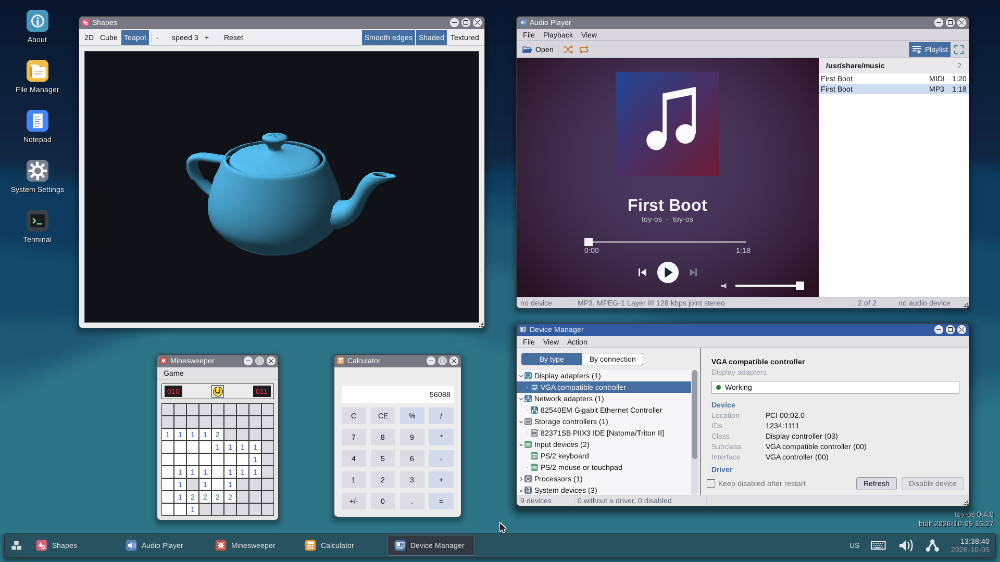

<h1 align="center">toy-os</h1>

<p align="center">
  A hobby x86-64 operating system, written from scratch in C and assembly —
  built with Claude.<br>
  Boots via GRUB into a 64-bit kernel with a ring-3 desktop, networking,
  USB, sound and a journaling disk-backed filesystem.
</p>

<p align="center">
  <a href="https://github.com/eveningworks/toy-os/actions/workflows/build.yml">
    
  </a>
  
  
  
  <a href="https://claude.com/claude-code">
    
  </a>
</p>

> [!NOTE]
> **An experiment in building an operating system with Claude, and in how
> far it can get.** All of
> toy-os is written by [Claude Code](https://claude.com/claude-code),
> Anthropic's agentic coding tool, except the third-party ports under
> `userland/ports/` (DOOM, Mbed TLS, dash, cJSON): a human makes the
> design calls and decides what ships; Claude does the implementation,
> the testing and the documentation. The conventions it works under are
> in [CLAUDE.md](CLAUDE.md), and the reasoning behind every design choice
> — including the ones that turned out wrong — is in
> [docs/decisions.md](docs/decisions.md).
>
> Nobody has audited it for security, and it is sure to have holes, so
> please don't run it in production, or on a machine with anything on it
> you care about.

<p align="center">
  
  
</p>

<p align="center">
  <a href="#highlights">Highlights</a> ·
  <a href="#try-it">Try it</a> ·
  <a href="#status">Status</a> ·
  <a href="#documentation">Documentation</a> ·
  <a href="#license">License</a>
</p>

---

## Highlights

A hobby operating system built one subsystem at a time, with the
reasoning behind each design decision written down — including the ones
that turned out wrong. It boots on real hardware and under QEMU.

- **The machine, by hand** — Multiboot2 and the long-mode switch, per-process
  page tables, NX/W^X, SMEP/SMAP, kernel ASLR, ACPI, and a **tickless**
  one-shot timer.
- **Real processes** — an ELF64 loader, a preemptive scheduler, `init` as
  pid 1 supervising services, signals and job control, threads with TLS,
  and **dynamic linking** against `/lib/libc.so`.
- **Its own filesystem** — TFS3, journaling, with `fsck`, beside FAT32, over
  IDE, AHCI, NVMe or virtio. It **installs itself** to another disk and
  **updates itself** from a build server.
- **A desktop outside the kernel** — the window manager and every app run in
  ring 3: a file manager, a tabbed terminal, an image viewer, an audio
  player, a task manager, System Settings, Minesweeper and **DOOM**.
- **Networking** — IPv4, ICMP, UDP and TCP on six NIC drivers, with DHCP,
  DNS, `wget` and an `httpd` serving the machine's own files.
- **USB, display and sound** — xHCI with hubs and report-descriptor HID, an
  Intel driver that programs the panel's mode itself, and AC'97, HD Audio
  and USB Audio mixed by a ring-3 daemon, with MP3 and MIDI decoded here.
- **Its own manual** — `doc ls` on the machine renders the same page this
  repository holds.
- **Tested from the inside** — in-kernel tests with fault injection, ring-3
  diagnostics, and a GUI suite that drives the desktop and asserts on pixels.

**[docs/features.md](docs/features.md) is the long version** — what each
of those actually is, and where the interesting decisions were.

## Try it

**Without building anything:** download `toy-os-live.iso` from
[Releases](https://github.com/eveningworks/toy-os/releases) and boot it
in QEMU — `run_release.sh`, beside it, does that for you — or write
`toyos-usb.img.gz` to a USB stick for real hardware. **BIOS/CSM only;
UEFI does not boot.**

> [!WARNING]
> **Running it is at your own risk, in a VM or on real hardware.** toy-os is a
> hobby experiment and comes with no warranty: if running or installing it
> breaks something, that is on you, not on this project. In QEMU it can still
> damage what you hand it — its disk image, and any USB device or disk you
> pass through. On real hardware, writing the USB image erases everything on
> the stick, and toy-os may hang on hardware it hasn't been tested on. Read
> [On real hardware](docs/building.md#running-a-release) first.

**From source** (on Debian/Ubuntu; [other distributions](docs/building.md#dependencies)):

```bash
sudo apt install build-essential nasm grub-pc-bin grub-common xorriso mtools qemu-system-x86 python3
git clone https://github.com/eveningworks/toy-os.git && cd toy-os
make run
```

The desktop comes up on its own. *Exit to shell* in the Start menu drops
to a prompt; `help` lists the commands and `doc <command>` reads a page.
`make run KVM=1` is much faster where `/dev/kvm` exists.

**[docs/building.md](docs/building.md)** has the rest — every `make run`
flag, `build.conf`, real hardware, testing a change and troubleshooting.

## Status

A hobby project under active development, not production software. The
current version is in [VERSION](VERSION); tagged builds are on
[Releases](https://github.com/eveningworks/toy-os/releases).

**Works today:** real hardware and QEMU boot; the shell; three
filesystems, partitions and an installer; the ring-3 desktop and its
apps; processes with pipes, signals, threads, job control, `mmap` and
dynamic linking; loadable kernel modules; pseudo-terminals; USB with
hubs, hot-plug, HID, Ethernet and audio; sound on three device classes,
including DOOM with music; an Intel display driver with backlight
control; ACPI shutdown; and networking good enough for `wget` to fetch
a real page over HTTPS and for `httpd` to serve the machine's own files.

**Known gaps:**

- **BIOS/CSM boot only** — GRUB's EFI build faults before the kernel runs.
- **One CPU** — other cores are discovered, and every one reports offline.
- **No privilege model** — no user accounts or permission checks.
- No USB mass storage, no `mprotect`, and swap that pages nothing out
  yet.

[docs/roadmap.md](docs/roadmap.md) tracks all of it, and
[docs/bugs.md](docs/bugs.md) what is broken right now.

## Documentation

Everything under [docs/](docs/) is written as the work happens,
including the decisions that turned out wrong.

| Document | Contents |
|---|---|
| [docs/building.md](docs/building.md) | Dependencies, every way to boot it, build options, releases on real hardware, testing a change, troubleshooting. |
| [docs/features.md](docs/features.md) | What is built, layer by layer, and where the interesting decisions were. |
| [docs/architecture.md](docs/architecture.md) | Which directory holds what, and why the boundaries are where they are. |
| [docs/decisions.md](docs/decisions.md) | "Why is this built this way?", indexed by topic. **Start here when something looks odd.** |
| [docs/roadmap.md](docs/roadmap.md) · [docs/bugs.md](docs/bugs.md) | What is not built yet, and what is broken — kept apart, because they are different questions. |
| [docs/commands.md](docs/commands.md) | The command index; each page also ships on the machine. |
| [docs/testing.md](docs/testing.md) · [docs/tools.md](docs/tools.md) | Driving the OS headlessly, and every script in `tools/`. |
| [CLAUDE.md](CLAUDE.md) | The conventions every change is written under. |

Reference material for one subsystem lives beside it —
[driver-guide](docs/driver-guide.md) and [devices](docs/devices.md) for
drivers, [gui-guidelines](docs/gui-guidelines.md) for the desktop,
[tfs3-spec](docs/tfs3-spec.md) for the filesystem's byte layout,
[boot-flags](docs/boot-flags.md) for the GRUB command line, and a design
document per staged subsystem.

## License

MIT — see [LICENSE](LICENSE), which carries the full inventory of
third-party material. In short:

- **`userland/ports/doom/` is GPL-2-or-later** (doomgeneric). It builds
  into one binary that nothing else links, so it is an aggregation and
  the rest of the repository stays MIT. The Doom IWAD is **not** in this
  repository — `tools/fetch_wad.py` obtains one, under id Software's own
  terms.
- `userland/ports/mbedtls/` (Mbed TLS) is taken under the Apache-2.0
  side of its dual licence, and builds into `/lib/libssl.so`.
- `userland/ports/dash/` is BSD-3-Clause and builds into `/bin/dash`;
  its one GPL file, `mksignames.c`, is not compiled --
  `tools/gen_signames.py` generates that table instead.
- `userland/ports/cjson/` is MIT, under its own copyright.
- The runtime-loadable fonts in `data/fonts/` are under the Bitstream
  Vera and SIL Open Font licenses, and the baked JetBrains Mono glyphs
  in `kernel/drivers/font_ttf.c` under the SIL Open Font License 1.1.
- The bundled `pci.ids` and `usb.ids` databases in `data/` are taken
  under the BSD-3-Clause side of their dual licence, and three Terminal
  colour schemes carry other projects' palettes (Solarized, Tango,
  Konsole).

`tools/check_licenses.py` fails the build if a vendored port or a shipped
font is missing from that inventory.
