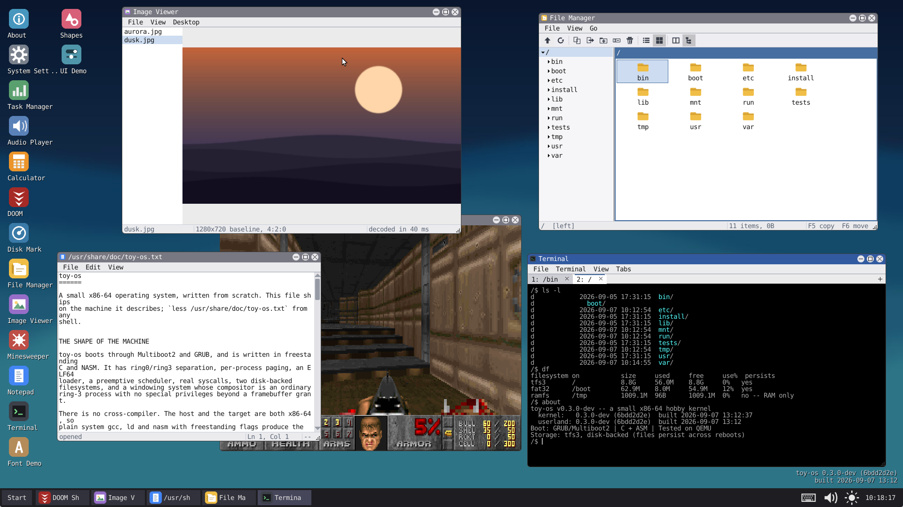
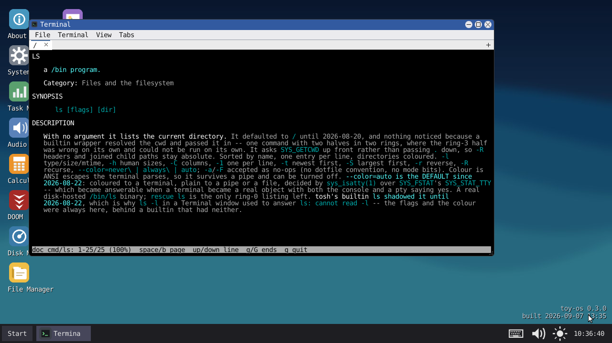

<h1 align="center">toy-os</h1>

<p align="center">
  A small x86-64 operating system, written from scratch in C and assembly.<br>
  Boots via GRUB into a 64-bit kernel with a shell, a window manager, and a
  journaling disk-backed filesystem.
</p>

<p align="center">
  <em>Built with Claude Code. A human makes the design calls; Claude does the
  implementation and the testing. Every change is built, tested in QEMU and
  reviewed before it lands.</em>
</p>

<p align="center">
  <a href="https://github.com/eveningworks/toy-os/actions/workflows/build.yml">
    
  </a>
  
  
  
  
</p>

<p align="center">
  
  
</p>

---

## Contents

- [What this is](#what-this-is)
- [How this was built](#how-this-was-built)
- [Project status](#project-status)
- [Quick start](#quick-start)
- [Highlights](#highlights)
- [Architecture](#architecture)
- [Development](#development)
- [Documentation](#documentation)
- [Releases](#releases)
- [License](#license)

## What this is

A hobby OS built one subsystem at a time, with the reasoning for each
decision written down as it happened. It boots on real hardware and under
QEMU, and it does not stop at "hello world from the kernel":

- **Real memory management** — a physical frame allocator, per-process
  page tables, **demand-paged heaps** (`sbrk` reserves; the page arrives
  on first touch), one allocator serving both `kmalloc` and ring-3
  `malloc`, NX/W^X on both the kernel and userspace, SMEP/SMAP, stack
  canaries and kernel ASLR.
- **Real processes** — an ELF64 loader, ring-3 user mode, a table-driven
  syscall layer, a preemptive scheduler, **an `init` as pid 1** that
  adopts orphans and **supervises services** described by files in
  `/etc/services.d` (the desktop is one, restarted if it dies), a process
  tree with pipes and `spawn`/`waitpid`, **signals and job control**
  (`Ctrl-C`, `Ctrl-Z`, `jobs`/`fg`/`bg`, `&`), and per-process FPU state
  across context switches.
- **A real terminal layer** — a terminal is an object with a line
  discipline, a `termios`, an owner and a foreground process group, so
  the physical console and a Terminal window are two clients of one
  implementation. `/bin/tosh` runs on a pty in a window, which makes the
  shell in it a real process; `Ctrl-C`, `Ctrl-Z`, pipes, redirection and
  job control are the same code in both places, and a full-screen editor
  runs in either.
- **A real filesystem, in a real partition** — TFS3: block groups, real
  inodes, hardlinks, journal transactions, superblock backups and an
  `fsck`. It journals metadata, so files survive a power cut. The VFS
  picks a backend by superblock probe, and boot scans the disk's
  MBR/GPT table for a partition to mount from -- **the stock `disk.img`
  is a GPT with the filesystem in partition 1**, the way an installed OS
  looks. `mkpart` writes a table, `parttable` reads one, and `fsformat`
  reformats the mounted volume.
- **A real GUI, and it is not in the kernel** — the window manager is
  itself a **ring-3 process**: movable, resizable windows, a taskbar, a
  Start menu built from `.desktop` files (picked up live), and a desktop
  of draggable icons with rubber-band selection. Apps are ordinary ring-3
  processes too, owning their windows over **TWP**, the Toy Window
  Protocol, served by **TWS** and programmed against with **Toykit**. The
  kernel keeps the framebuffer and the protocol; everything above them is
  a process, and killing the desktop is survivable. Pictures are ring-3 too: a
  **baseline JPEG decoder** in the toolkit's library gives the desktop a
  real wallpaper and an Image Viewer, with no image parser anywhere in
  the kernel. There is a game, too: **Minesweeper**, which is where the
  desktop learned to give a right-click to the application under the
  cursor instead of keeping it for the window menu. And there is a
  **File Manager** — two directory panes side by side, in the Norton
  Commander tradition rather than Explorer's, because copying between
  two visible directories needs neither a clipboard nor drag-and-drop
  and this system has neither yet. Its file operations are spawned
  `/bin/cp` and `/bin/rm` children, so there is one implementation of
  what copying means and it works at a shell prompt too.
- **Its own test suite** — `make test` boots the OS headless, runs
  in-kernel tests including deliberate fault injection, and exits
  non-zero on failure. A separate GUI suite drives the desktop over a
  serial debug channel and asserts on pixels.

No cross-compiler is needed: host and target are both x86-64, so the
system GCC works with `-ffreestanding` and kernel-appropriate flags.

## How this was built

toy-os is written with [Claude Code](https://claude.com/claude-code),
Anthropic's agentic coding tool. A human makes the design calls; Claude does
the implementation and the testing.

The conventions it works under are in [CLAUDE.md](CLAUDE.md), the reasoning
behind the design is in [docs/decisions.md](docs/decisions.md), and
`tools/preflight.sh` is the gate every change passes before it lands.

## Project status

**Version 0.3.0-dev.** A hobby project under active development, not
production software. What that means concretely:

**Works today** — booting on real hardware and QEMU, the shell and its
line editor, both filesystems with `fsck` and live reformatting, the
window manager and its apps, fonts loaded and rasterized from disk at
runtime, ring-3 processes with pipes and `spawn`/`waitpid`, a TTY layer
with pseudo-terminals — so `Ctrl-C` interrupts a job, `Ctrl-Z` suspends
one, and a full-screen editor runs in a Terminal window — and the full
test suite: a few hundred in-kernel tests, the ring-3 diagnostics, and
the GUI tools `gui_regress.py` runs as one table.

**[Milestone 41](docs/wm-ring3-design.md) is complete** (2026-08-18):
the window manager is an ordinary ring-3 process. `gui` spawns
`/bin/wm/system/toywm`, which claims the compositor role, is granted the
real framebuffer, composites the desktop and serves every client through
the window protocol. The ring-0 window manager and its widget set are
deleted — about 10,400 lines — so there is one implementation again.
Killing the desktop is survivable: the kernel revokes the grant, asks
client windows to close and restores the text console.

**[init](docs/init-design.md) holds pid 1 and starts the desktop**
(2026-08-18): `system.default_target` (`text`/`graphical`) says what the
machine is for, `/etc/services.d` says what to start, and init restarts a
service that dies — with a backoff, a give-up so a crash loop cannot spin
the machine, and `Restart=on-failure` semantics so a clean exit (the Start
menu's *Exit to shell*) means what it says. `target=text` on the GRUB line overrides the target for
one boot without rewriting the file. Both of the things listed here as
in progress have since landed: the console is a TTY object, and a `text`
boot reaches a ring-3 shell with the kernel's own standing down.

**Job control works** (2026-08-22): `Ctrl-Z` suspends the foreground
job, `jobs`/`fg`/`bg` manage it, `&` backgrounds one, and a background
job that reads the terminal is stopped by `SIGTTIN` rather than
competing with the shell for the keyboard. A pipeline suspends and
resumes as one process group. The same code serves the physical console
and a Terminal window, which is the test of whether the TTY layer is
real.

**Known gaps** — no USB stack, so input on real hardware depends on the
firmware's legacy PS/2 emulation. No networking and no SMP. Demand
paging covers the heap and the user stack, but there is no region list,
so no `mmap` yet. No shared libraries, and no privilege model: there are
no user accounts and no permission checks, so anything ring 3 can ask
for, any process can ask for. [docs/roadmap.md](docs/roadmap.md) tracks
all of it, including a candid known-issues list.

## Quick start

### Dependencies

A C toolchain, NASM, GRUB's rescue-image tools, and QEMU.

| Distribution | Command |
|---|---|
| **Debian / Ubuntu / Mint** | `sudo apt install build-essential nasm grub-pc-bin grub-common xorriso mtools qemu-system-x86 python3` |
| **Arch / CachyOS / Manjaro** | `sudo pacman -S --needed base-devel nasm grub xorriso mtools qemu-full python` |
| **Fedora / RHEL / Rocky** | `sudo dnf install gcc make binutils nasm grub2-tools grub2-pc-modules xorriso mtools qemu-system-x86 python3` |
| **openSUSE** | `sudo zypper install gcc make binutils nasm grub2 grub2-i386-pc xorriso mtools qemu-x86 python3` |
| **Alpine** | `doas apk add build-base nasm grub grub-bios xorriso mtools qemu-system-x86_64 python3` |
| **Void** | `sudo xbps-install -S base-devel nasm grub xorriso mtools qemu python3` |

<details>
<summary>What each package is for, if your distribution names them differently</summary>

| Need | Why |
|---|---|
| `gcc`, `binutils`, `make` | Compiles and links the kernel. Any GCC that can target x86-64 works; no cross-compiler required. |
| `nasm` | Assembles the boot, interrupt and context-switch stubs. |
| `grub-mkrescue` + `xorriso` + `mtools` | Builds the bootable ISO. `grub-mkrescue` needs all three, and the BIOS modules package (`grub-pc-bin` on Debian, `grub2-pc-modules` on Fedora, `grub2-i386-pc` on openSUSE) is easy to miss. |
| `qemu-system-x86_64` | Runs it. |
| `python3` | Build-time disk seeding and the test/dev tools. Pillow (`pip install pillow`) is needed only for screenshots. |

Verified firsthand on Arch/CachyOS; the Debian/Ubuntu list is what CI
installs on every push. The rest are package-name translations of the
same requirements — corrections welcome.
</details>

<details>
<summary>Setting up another machine (or a fork), end to end</summary>

Everything that matters is in the repository — the build, the tools in
`tools/`, and the docs — so a clone plus the packages above builds and
tests. Three things are **not** in the clone, and one of them fails
silently.

```bash
# 1. Packages (Arch/CachyOS; see the table above for other distributions)
sudo pacman -S --needed base-devel nasm grub xorriso mtools qemu-full python

# Optional. None are needed to build; each removes a rederive cost and
# docs/tools.md explains what for. ccache is the one worth having first,
# because the gate starts with `make clean` every time (2.37s -> 0.40s).
sudo pacman -S --needed ccache bear ruff shellcheck github-cli python-pillow docker

# 2. KVM, if you want tools/kvm_soak.py and the timing bugs TCG hides.
#    Docker is only for tools/qemu_matrix.py.
sudo usermod -aG kvm "$USER"
sudo systemctl enable --now docker
sudo usermod -aG docker "$USER"
#    LOG OUT AND BACK IN -- group changes do not reach a running session.
#    Then: [ -w /dev/kvm ] && echo "KVM ok"

# 3. An SSH key, if you intend to push. (`gh auth login` can generate and
#    upload one for you instead -- choose SSH when it asks.)
ssh-keygen -t ed25519 -f ~/.ssh/github_key -C 'toy-os dev box'
cat >> ~/.ssh/config <<EOF

Host github.com
    HostName github.com
    User git
    IdentityFile ~/.ssh/github_key
    IdentitiesOnly yes
EOF
chmod 600 ~/.ssh/config ~/.ssh/github_key
cat ~/.ssh/github_key.pub     # add to GitHub -> Settings -> SSH keys
ssh -T git@github.com         # should greet you by name

# 4. Clone (substitute your fork's URL if you have one)
git clone git@github.com:eveningworks/toy-os.git
cd toy-os

# 5. THE COMMIT IDENTITY -- the step that fails silently.
#    It is per-repository, so the clone did NOT bring one, and commits
#    would use your GLOBAL identity: your real name and address. This
#    project scrubbed exactly that out of every prior commit with a
#    history rewrite, and nothing in git warns you beforehand.
git config --local user.name  'toy-os'
git config --local user.email 'noreply@toy-os.local'
#    On a fork, your own name and address are fine -- the point is that
#    it is a CHOICE rather than a leak. tools/preflight.sh refuses to run
#    until SOME local identity is set, which is where the check lives
#    because .git/hooks is not cloned either.

# 6. Confirm the machine before trusting a result from it
bash tools/preflight.sh                        # build + boot + both suites
python3 tools/gui_regress.py --logs /tmp/gui   # ~1.5 min, 25 GUI tools

# 7. gh, only for releases and `gh workflow run` -- not for push
gh auth login                                  # choose SSH as the protocol
```

**What you do not copy.** `disk.img` is gitignored and reseeded by
`make iso`; `build/`, `toy-os.iso` and `compile_commands.json` are all
regenerated. Nothing needs a GitHub token in the environment — the whole
build and test path is offline, so you can work for a week without
authenticating and only need it to push.

**On a dedicated box.** KVM wants bare metal rather than a nested VM —
`tools/kvm_soak.py` exists for what TCG cannot show. And the host's QEMU
version is a real variable: `tools/qemu_matrix.py` exists because a
virtio-blk defect was invisible on one version and reproduced every time
on another, so keeping two machines on the same distribution means a
difference between them is your code rather than your toolchain.
</details>

### Build and run

```bash
git clone https://github.com/eveningworks/toy-os.git
cd toy-os
make run
```

That builds the kernel, seeds a disk image, produces `toy-os.iso` and
boots it in QEMU. **init brings the desktop up on its own**; *Exit to
shell* in the Start menu drops to the `/>` prompt, and `gui` goes back.
For a text-only boot, `make iso KCMDLINE="target=text"`. PageUp/PageDown
scrolls the console history, including the boot log.

```bash
make            # kernel.bin + the userland ELF binaries
make iso        # + toy-os.iso, seeding disk.img
make run        # build + boot in QEMU with a graphical window
make live-iso   # a Live CD that boots with no disk attached at all
make demo-iso   # boots straight into a scripted tour
make debug      # boot frozen (-s -S) for GDB
make test       # boot headless, run the in-kernel test suite
make verify     # full gate: clean build + iso + boot test + test suite
```

There is **one run target**, and everything that would otherwise be its
own is a variable on it — so any combination works without a target per
combination:

```bash
make run KVM=1        # KVM-accelerated instead of emulated (needs /dev/kvm)
make run VIRTIO=1     # virtio for EVERY device class: disk, GPU and input
make run NOGRAPHIC=1  # serial console only -- use this over SSH
make run MENU=1       # show GRUB's boot menu instead of booting straight through
make run AUDIO=1      # PC speaker wired to sound, so `beep` is audible
make run MEM=512      # a smaller machine
make run LIVE=1       # the Live CD, with no disk attached
make run DEMO=1       # the scripted tour
make run KVM=1 VIRTIO=1   # ...or any mix
```

**Each device class picks its implementation by name**, and `VIRTIO=1`
is simply the switch that sets all three at once. A per-class value
overrides it, so `VIRTIO=1 VGA=std` is a legal thing to ask for:

```bash
make run DISK=virtio        # virtio-blk, and NO IDE controller at all
make run VGA=virtio         # the virtio-gpu driver
make run VGA=vmware         # the adapter with a hardware cursor
make run INPUT=virtio       # virtio keyboard, mouse and tablet
```

A *name* rather than a boolean because a boolean cannot express a third
one, and this machine is going to grow them — NVMe is on the roadmap,
and an `NVME=1` beside a `VIRTIO=1` would immediately raise "what does
setting both mean?". `make help` lists every axis.

<details>
<summary>Troubleshooting</summary>

| Symptom | Cause and fix |
|---|---|
| `grub-mkrescue not found` | Install GRUB's rescue tools (`grub-common` on Debian, `grub2-tools` on Fedora). The build looks for both `grub-mkrescue` and `grub2-mkrescue`. |
| `grub-mkrescue` fails on *"cannot find `xorriso`"* or mtools | Install `xorriso` **and** `mtools`; it needs both even for a BIOS-only image. |
| ISO builds but QEMU says *"no bootable device"* | The BIOS modules package is missing — `grub-pc-bin` (Debian), `grub2-pc-modules` (Fedora), `grub2-i386-pc` (openSUSE), `grub-bios` (Alpine). |
| No window appears (e.g. over SSH) | `make run NOGRAPHIC=1`. |
| The mouse doesn't move in QEMU | Don't add `-device usb-tablet`/`usb-mouse`. This kernel's mouse driver is PS/2 only, and an explicit USB pointer device makes QEMU route motion there instead. |
| Everything is very slow | `make run` emulates the CPU; `make run KVM=1` runs it natively. That only helps compute-bound code — *ATA* disk I/O measures ~1.9× **slower** under KVM, since each port-I/O instruction becomes a VM exit. That penalty is ATA's, not KVM's: `make run KVM=1 DISK=virtio` puts the disk on virtio-blk and measures ~10× ATA's write throughput, because a virtqueue barely touches port I/O at all. |
| Drawing is slow on real hardware but fine in QEMU | Reproduce it with `make run KVM=1`. Plain `make run` **ignores guest memory types entirely**, so a write-combined framebuffer behaves like cached RAM and a whole class of graphics bug is invisible. `gfxbench` reports which mechanisms are live. |
| `disk.img` is 9 GB | It's a *sparse* file — it costs only what is actually written. `make clean-disk` wipes it. |

For breakpoint debugging, `make debug` boots frozen against QEMU's own
GDB stub — no kernel-side GDB code involved:

```bash
gdb build/kernel.bin -ex "target remote localhost:1234"
```

Both `CFLAGS` and `USERLAND_CFLAGS` carry `-g`, so the kernel and every
userland ELF have real DWARF symbols.
</details>

### Using it

Type `help` at the prompt. [docs/commands.md](docs/commands.md) indexes
one page per command under [docs/commands/](docs/commands/), and is the
full command reference; [docs/boot-flags.md](docs/boot-flags.md) covers
what you can pass on the GRUB command line.

## Highlights

**Boot and hardware.** Multiboot2 via GRUB2, with the 32→64-bit long-mode
transition done by hand. Linear RGB framebuffer falling back to 80×25 VGA
text. PS/2 keyboard and mouse sharing the 8042 through one dispatcher,
with keyboard layouts as *data files* generated from Linux's own XKB data
rather than a compiled-in table. PIT, CMOS RTC, PC speaker, MBR/GPT
partition parsing, and a **virtio** stack: PCI capability walking and
64-bit BAR decoding underneath a shared modern-virtio transport, with
`virtio-blk` on top of it as the preferred disk, `virtio-rng` feeding
the kernel's entropy pool (a QEMU guest usually has no RDSEED/RDRAND,
and the jitter fallback is weakest under emulation), and **`virtio-gpu`
as a real display driver** — resource, scanout, transfer-and-flush and
its own cursor queue, programming the mode itself so `video=1920x1080`
is honoured rather than left to whatever GRUB negotiated, and
**`virtio-input`** (keyboard, mouse and tablet) feeding an **input core**
whose canonical event is evdev-shaped, so PS/2, virtio and a future USB
HID driver are all sources in one registry — with an opt-in
diagnostic log (`kernel.kbdtap`, off by default) that `kbd` prints as
all four encodings of a keypress at once — scancode, keycode, character,
modifiers — which is how a key that works on one keyboard and not
another stops being a mystery — and the first virtio
devices here to complete on a real interrupt rather than a poll. One
transport, so the next device (net) is a driver rather than a
bring-up project — and it is about **10× ATA's write throughput under
KVM**, because a virtqueue is shared memory with one doorbell where ATA
is dense with port I/O and every one of those is a VM exit.

**Memory hardening.** NX and W^X from each ELF segment's real `p_flags`,
and the kernel's own identity map is W^X too — `.text` is the only
executable range and is read-only, with CR0.WP set so ring 0 honours it.
SMEP and SMAP wherever the CPU reports them, with kernel code reaching
user memory only through copy helpers that go via the kernel's own map,
so **EFLAGS.AC is never set anywhere** and there is no STAC/CLAC window.
Guard pages below user stacks and kernel stacks, randomised stack
canaries, heap red-zones behind a runtime switch, and **kernel ASLR** —
the kernel relocates itself to a random base at boot and patches ~7,400
of its own absolute references. A mapping records whether it OWNS its
frame, so teardown cannot hand back memory somebody else is still using,
and `meminfo audit` checks every live address space against the
allocator.

**Filesystems.** [TFS3](docs/tfs3-spec.md) is the default: block groups,
128-byte checksummed inodes, hardlinks, atomic rename and truncation,
32-slot journal transactions, ext-style superblock backups, ~590k files
on a 9 GiB volume. It scales files to gigabytes through direct and
single/double/triple-indirect pointers, batches ATA flushes, TRIMs freed
blocks back to the host, and refuses to touch a disk whose superblock
could not be read rather than destroying a possibly-good filesystem.

**Graphics and GUI.** Real fonts, two ways: eight sizes of JetBrains Mono
baked to bitmaps at build time as the guaranteed fallback, and a
fixed-point TrueType rasterizer that loads a `.ttf` from
`/usr/share/fonts` at runtime — so any size works, not just a baked one,
and a proportional face gets genuine per-glyph advance widths and real
kerning from the font's own tables. A face is a *family*: bold is a
second file loaded alongside the regular one, or — where a family has no
bold — synthesized by thickening the regular outlines, which is what GDI
does. Because the whole UI is font-*derived*, changing the face or the
size reflows everything rather than clipping it, live, without
restarting anything.

Fonts come in **two tiers**. The session font is the desktop's face, in
both weights, rasterized once in the kernel and mapped read-only into
every window — so all text on screen matches the desktop's setting by
construction rather than by each app being careful. An app that needs
something that font cannot express — a different face, a heading at
twice the body size — rasterizes it *itself*, in ring 3, using the same
rasterizer, into its own memory; that is what every Wayland client does.
The honest limit: a loaded face is rasterized into the same 101-glyph
set the baked one carries — ASCII plus six Nordic letters — so its other
few thousand glyphs are parsed and unreachable until UTF-8 lands, and
kerning is read from the legacy `kern` table only, so a face that keeps
its kerning in GPOS renders unkerned.

**Images are decoded in ring 3, by a library, and the kernel never sees
one.** A baseline JPEG decoder (`userland/lib/uimg_jpeg.c`) sits behind
a codec table keyed on magic bytes, so a second format is a row and a
file rather than a branch; it does the whole job in fixed point, since
there is no floating point in either ring, and upsamples chroma with
libjpeg's triangle filter so the output matches what any other viewer
shows. Files it cannot handle — progressive, arithmetic-coded, 12-bit,
CMYK — are refused *by name*, which is a different answer from "corrupt"
and reads as one. That is the opposite of the call made for fonts, which
are parsed in ring 0 because the console needs glyphs before any process
exists; nothing in ring 0 needs a picture. What proves it works is
libjpeg itself: the same source file is compiled on the host and
compared against libjpeg over a couple of hundred generated images, nine
committed vectors run the same comparison in ring 3, and a GUI tool
checks the framebuffer against libjpeg's decode of the wallpaper pixel
for pixel.

Double-buffered rendering with damage-region clipping, and a
compositor whose damage invariant is enforced by a verification mode
that re-renders each frame unrestricted and reports any pixel that
changed without being declared — over the chrome, desktop, taskbar,
menus and cursor it draws itself. A *client's* content is another
process's memory with no buffer-release handshake to hold it still, so
those pixels are masked out rather than judged, which is the difference
between a check that finds real bugs and one that reports twenty-two
imaginary ones. Apps declare a layout rather than coordinates, and a page
too big for its window scrolls.

**Userland.** Every ring-3 program is just a `main()`: crt0 provides
`_start` over the standard SysV stack layout, and libsys gives one typed
wrapper per syscall. The shared kernel toolkit is compiled a second time
under the C names, so a ring-3 `strlen` and the kernel's `k_strlen`
cannot diverge — and the same rule gives ring 3 the kernel's own
allocator as `malloc`/`free`, its line editor, and its ANSI parser — so
both shells agree about what Ctrl-A does, and the console and a Terminal
window agree about what `ESC[4;12H` means. Adding a program is a
`.c` file with no Makefile edit. Beside that sits **tolibc**
([docs/libc-design.md](docs/libc-design.md)) — stdio, math, time,
dirent, setjmp and scanf — which is the one part of this tree that aims
to be COMPLETE rather than minimal, because its audience is code that
has not been written yet.

**Syscalls.** One table maps each number to its handler, and the handlers
live with the subsystem that owns them — the shape Linux and NT both
settled on. The same row carries what `strace` prints, so tracing and
dispatch cannot disagree about which syscalls exist.

**Introspection.** Kernel state reaches ring 3 through one self-describing
registry rather than a `/proc` filesystem: a subsystem registers a
provider for a fact, and a command formats it — `ps`, `df`, `lspci`,
`lscpu`, `meminfo`, `kstack`, `tty`, `kbd`. Answering *"what did the
machine actually do?"* is treated as a first-class job, distinct from a
test asserting it did the right thing: `strace` decodes a syscall per
line, `meminfo audit` compares every live address space against the
allocator, `tty` names who is holding the keyboard, and `kbd` prints a
keypress at every stage at once — PS/2 scancode, evdev keycode, the
character the layout produced, and the modifiers held — which is how a
key that works on one keyboard and not another stops being a mystery.
The log behind that last one is **off by default** and wipes when
switched off, because there is no privilege model here and a buffer of
recent keystrokes is not something to keep without being asked.

## Architecture

Directories are subsystems, not filing cabinets — where a file lives says
what kind of thing it is.

```
kernel/
  arch/x86_64/  anything a different CPU would need rewritten: boot and
                long mode, interrupts, GDT/TSS/IDT, PIC, paging, ASLR
  core/         bring-up and whole-machine concerns: kernel_main,
                multiboot, timers, serial + the debug console
  mm/           physical frames, address spaces, the kernel heap
  proc/         ELF64 loader, the syscall table, scheduler, window server
  fs/           TFS3 behind the probe-selecting VFS
  tty/          the terminal object: line discipline, ptys, tty0
  lib/          services with no hardware of their own: the shared
                toolkit (strings, numbers, formatting, paths, line
                editing), JSON, klog, /etc config, entropy, tunables
  drivers/      one piece of hardware each, plus the registries a new
                one plugs into (display, block, input)
  test/         the KTEST harness itself
  include/      split by audience and ENFORCED by include paths: api/
                (what apps may use), abi/ (the kernel<->userland
                contract), kernel/ (internal, off apps/'s path)

apps/           kernel-space programs: the shell, the demo, tab completion.
                No GUI lives here any more.

userland/       ring-3 programs, split by ROLE:
  rt/           crt0, libsys, the signal trampoline, linker script
  libc/         tolibc -- the C library, aiming to be COMPLETE
  ui/           Toykit -- the toolkit clients program against
  lib/          non-UI libraries: the tosh shell, images, history
  wm/           the window manager, itself a ring-3 program
  gui/          windowed apps      -> seeded to /bin
  bin/          command-line tools -> seeded to /bin
  tests/        single-mechanism diagnostics -> seeded to /tests
  ports/        vendored third-party source, kept separate on purpose
  doom/         our backend for it, deliberately OUTSIDE ports/

seed/, data/    what gets mirrored onto disk.img at build time
tools/          build, test and delivery tooling (see Development)
docs/           design records, specs, and the decision log
```

Source discovery is recursive, so a new file — or a whole directory —
under `kernel/` or `apps/` needs no Makefile edit. Header dependencies
are tracked, and `tools/check_deps.py` proves per build directory that
the tracking is actually live.

`kernel_main()` brings up the hardware and calls `apps_start()`, which
launches the shell without naming it: the shell is simply the first
entry in the app registry, and that seam keeps the kernel core ignorant
of what apps exist.

## Development

```bash
make verify                     # the full gate: clean build + iso + boot test + ktest
bash tools/preflight.sh         # same, plus a git status summary (~25s)
python3 tools/gui_regress.py    # every GUI test tool as one table (~1.5 min)
```

Writing a test is a `KTEST()` block in a `*_test.c` next to the code it
exercises. It registers itself through a linker section — no registry,
no Makefile edit:

```c
KTEST("mm", "kzalloc returns zeroed memory") {
    uint8_t *p = kzalloc(256);
    KTEST_ASSERT(p != 0);
    for (int i = 0; i < 256; i++) KTEST_ASSERT_EQ(p[i], 0);
    kfree(p);
}
```

`kernel/include/kernel/fault_inject.h` can fail the next N disk writes,
disk reads or `kmalloc` calls, which is how the error paths are tested
at all.

Selected tools, each documented in its own docstring:

| Tool | What it's for |
|---|---|
| `vm.py` | Start a headless VM and run shell commands against it, getting **text** back: `vm.py run "fsck"`. Usually a better check than a screenshot. |
| `ktest_run.py`, `usertest_run.py`, `faulttest_run.py` | The in-kernel suite, the ring-3 `/tests` diagnostics, and the ones that fault ON PURPOSE — asserted against the kernel's crash report rather than an exit code they don't have. |
| `boot_smoke_test.py` | Fast "does it still boot cleanly", no GUI. |
| `gui_debug.py` | Asks the WM what it is doing — window rects, z-order, hit-testing, damage — instead of measuring a screenshot. |
| `gui_regress.py` | Every GUI test tool, each on its own fresh disk image and VM, as one pass/fail table. |
| `damage_sweep.py`, `damage_hunt.py` | Walk the interactions that break the compositor's damage invariant, over one seed or many. |
| `flake_hunt.py` | Runs one tool N times and reports which CHECKS failed and how often — a rate, not a verdict. |
| `pixel_probe.py` | Reads exact pixel values out of screenshots, so a rendering change is a number rather than an impression. |
| `frame_balance.py`, `mem_stress.py` | Physical memory: does a process's teardown return exactly what it took, and does the machine survive running out? The patterns written are address-derived, so two mappings sharing one frame is detectable. |
| `check_deps.py`, `check_layout.py`, `check_docs.py`, `check_dispatch.py`, `check_widget_ops.py`, `check_tool_commands.py` | The build's own invariants: header tracking is live, the disk matches its documented layout, the docs have no dead pointers, no dispatch chain has quietly grown big enough to want a table, no widget's ops table is missing a slot it needs, and no tool drives a guest command that has been renamed away. |
| `ondemand_sweep.py` | Runs the ~21 test tools that neither the gate nor `gui_regress.py` covers, and reports which have rotted — two were found red by accident after failing for an unknown period. A skip is counted apart from a pass. Never a gate. |
| `predates.py` | Answers "was this already broken?" by measuring: stashes the tree, rebuilds at HEAD, runs the command, restores, compares. |
| `qmp_test.py`, `gui_flow.py`, `shell_flow.py` | Drive the GUI over QEMU's QMP socket, with the mouse/keyboard gotchas already handled. |
| `tfs3_writer.py` | Read, write, inspect and corrupt-for-testing files inside a `disk.img` from the host, without booting. `--at-lba`/`--sectors` reach a filesystem inside a partition. |
| `fs_switch_test.py` | Proves probe, wipefs, live `fsformat`, and reboot persistence. |
| `partition_test.py` | Boots with the filesystem inside an MBR or GPT partition. Its real check is `df`: a kernel ignoring partitions still boots, so "it booted" proves nothing. |
| `regex_hostcheck.py` | tolibc's `<regex.h>` against **glibc's**, over one shared case table — an oracle sharing no code is the only thing that catches a wrong expectation. |
| `kbd_test.py`, `keyboard_paths_test.py` | The input path, asserted on both drivers: that the same keys produce the same keycode and character over PS/2 and virtio-input, and that `kbd`'s four columns say what each stage really did. |

`CLAUDE.md` documents the conventions and environment quirks in depth.

## Documentation

| Document | Contents |
|---|---|
| [docs/decisions.md](docs/decisions.md) | Topic-indexed answers to "why is this built this way?", over [docs/decisions/](docs/decisions/) — split by area. Start here when something looks odd. |
| [docs/roadmap.md](docs/roadmap.md) | What's planned, grouped into layers from the kernel up, with a "ready now" list and the known issues. |
| [docs/roadmap-details.md](docs/roadmap-details.md) | The per-item reasoning and test plans behind that list. |
| [docs/bugs.md](docs/bugs.md) | What is currently BROKEN, one line each, with the reproduction in roadmap-details. Separate from the roadmap because "not built yet" and "misbehaving" are different questions. |
| [docs/conventions/](docs/conventions/) | The conventions `CLAUDE.md` indexes by headline, written up in full and split by area: kernel, GUI, storage, shell, build. |
| [docs/testing.md](docs/testing.md) | How to run and drive this OS headlessly, the QMP mechanics, and what the emulator does not model. |
| [docs/tools.md](docs/tools.md) | Every script in `tools/`: what it does, why it exists, and the traps it encodes. |
| [docs/settings-and-queries.md](docs/settings-and-queries.md) | Facts vs settings vs tunables, and how an app reads or changes either. |
| [docs/query-design.md](docs/query-design.md) | How kernel state reaches ring 3, and why it is not `/proc`: `SYS_QUERY`, a self-describing registry, and a provider per fact. |
| [docs/libc-design.md](docs/libc-design.md) | `tolibc`, the C library — what it covers, and why its bar for adding a function is the opposite of the rest of the project. |
| [docs/commands.md](docs/commands.md) | The command index; [docs/commands/](docs/commands/) has one page each. |
| [docs/signals-design.md](docs/signals-design.md) | Signals, a foreground process, and what `Ctrl-C` needs. Every stage is built — delivery, dispositions, job control, and ring-3 handlers with a `SA_RESTORER` from userland. |
| [docs/tty-design.md](docs/tty-design.md) | The TTY layer: a terminal as an object, pseudo-terminals, and one implementation of `Ctrl-C` and `Ctrl-Z` for the console and a window alike. Stages 1–3 built; virtual terminals are what remain. |
| [docs/boot-flags.md](docs/boot-flags.md) | Every word the kernel looks for on the GRUB command line. |
| [docs/filesystem-layout.md](docs/filesystem-layout.md) | What lives where on the OS's own disk. Checked against the built image by `tools/check_layout.py`. |
| [docs/gui-guidelines.md](docs/gui-guidelines.md) | How the GUI should look and behave, and how to verify a change to it properly. |
| [docs/uapp-design.md](docs/uapp-design.md) | Toykit's design: how a ring-3 GUI app is written, and the staging that got there. |
| [docs/wm-ring3-design.md](docs/wm-ring3-design.md) | Milestone 41 — how the window manager was moved out of the kernel, stage by stage. Complete. |
| [docs/init-design.md](docs/init-design.md) | The staged plan for an init as pid 1, the process tree under it, and the shell moving to ring 3. |
| [docs/process-isolation.md](docs/process-isolation.md) | The full ring0/ring3 build-up, told as it was built, bugs included. |
| [docs/tfs3-spec.md](docs/tfs3-spec.md) / [design](docs/tfs3-design.md) | Byte-level format of the default filesystem, and the reasoning behind it. |
| [docs/tfs2-spec.md](docs/tfs2-spec.md) | Byte-level format of the removed TFS2 backend, kept for the record. |
| [docs/live-cd-design.md](docs/live-cd-design.md) | How the Live CD carries a filesystem image as a GRUB module. |
| [docs/arch-portability.md](docs/arch-portability.md) | What is and isn't x86-64-specific, and what a second architecture would take. |
| [kernel/README.md](kernel/README.md), [apps/README.md](apps/README.md) | Where a new file goes, and how to add an app. |

## Releases

Tagged releases live on
[GitHub Releases](https://github.com/eveningworks/toy-os/releases). Each
ships `toy-os.iso`, a gzipped `disk.img.gz` and `run_release.sh`, a
standalone launcher needing no checkout. The disk image matters: there is
no installer yet, so the pre-seeded image is what puts `/bin/ls` and
friends on the filesystem — the ISO alone boots into a near-empty one.

## License

MIT — see [LICENSE](LICENSE), which carries the full inventory of
third-party material. In short:

- **`userland/ports/doom/` is GPL-2-or-later** (doomgeneric). It builds
  into one binary that nothing else links, so it is an aggregation and
  the rest of the repository stays MIT. The Doom IWAD is **not** in this
  repository — `tools/fetch_wad.py` obtains one, under id Software's own
  terms.
- `userland/ports/cjson/` is MIT, under its own copyright.
- The five runtime-loadable fonts in `data/fonts/` are under the
  Bitstream Vera and SIL Open Font licenses, with each notice shipped
  beside the font.
- The baked JetBrains Mono glyph data in `kernel/drivers/font_ttf.c` is
  under the SIL Open Font License 1.1 ([tools/OFL.txt](tools/OFL.txt)).
- The bundled `pci.ids` database in `data/` has its own terms.

`tools/check_licenses.py` fails the build if a vendored port or a
shipped font is missing from that inventory — the font list had already
drifted from two to five before it existed.
